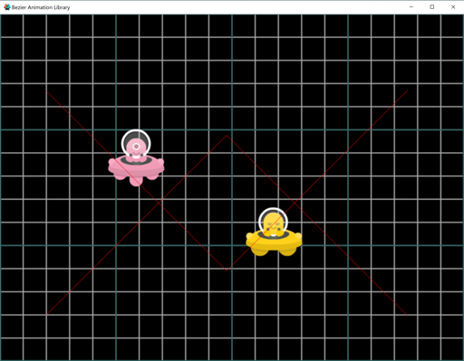
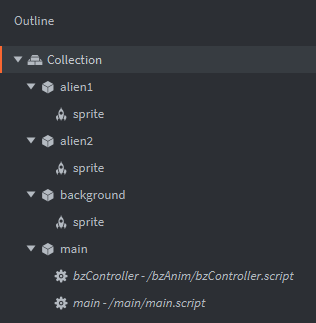

# Bezier Animation Library

This is a Lua/Defold-based animation library that allows you to send graphics objects on a non-linear (bezier curve) path.

## Installation
You can use bezierLibrary in your own project by adding this project as a Defold library dependency. Open your game.project file and in the dependencies field under project add:

https://github.com/jbp4444/bzAnim/archive/refs/heads/main.zip

Once added, you should include the bzController.script in your main collection, then include the bzLibrary.lua module in your own graphics objects scripts:

```lua
local bz = require("bzAnim.bzLibrary")
```

## Usage
In your main collection file, include the `bzController.script` - it can be almost anywhere since it will 'register' itself with the user-facing library.  E.g. create an empty graphics object, then do 'Add Component File' to attach the `bzController.script` to it.

In your script, you first include the library as above (`local bz=require('bzAnim.bzLibrary')`) and then you can add new animations with:

```lua
bz.animate({ 
	obj = gfx_obj_url, 
	duration = 4.0,   -- default=1.0
	delay = 0.0,      -- default=0.0
	path={ -- starts at current position, say x=100, y=100
		{ x=100,y=500 },
		{ x=500,y=500 },
		{ x=900,y=500 },
		{ x=900,y=100 },
	},
})
```

The system will then automatically update the graphics object's position every frame until it is complete.

By default, the system will prepend the graphics object's current position to the path -- so that the animation starts smoothly from where the object is.  If you want to "jump" to a new location (first location in the path), then add the argument `prepend_current=false`.

To make the animation path easier/more compact to write, the system will interpret `x=nil`, `y=nil`, and `z=nil` to mean "the same as the previous point".  So the previous path could be written as:

```lua
bz.animate({ 
	obj = gfx_obj_url, 
	duration = 4.0,   -- default=1.0
	delay = 0.0,      -- default=0.0
	path={ -- starts at current position, say x=100, y=100
		{ y=500 },  -- x stays the same at 100
		{ x=500 },  -- y stays the same at 500
		{ x=900 },  -- y stays the same at 500
		{ y=100 },  -- x stays the same at 900
	},
})
```

(if `prepend_current=false` then you must provide a full `x`, `y`, `z` position for the first point in `path`)


## Easing Functions
The animation sequence normally runs at a constant "speed" based on the parametric-time inside the Bezier calculations.  If you have a reasonably straight path, this may look like a normal, constant-speed movement.  If, however, you have a complex path, then the "Bezier movement" may not look natural (or not look constant-speed) ... or maybe you don't want it to look constant-speed.  In those cases, you can experiment with the easing functions to alter the mapping between real-time and Bezier-time:

```lua
bz.animate({ 
	obj = gfx_obj_url, 
	duration = 4.0,   -- default=1.0
	path={ -- starts at current position
		{ x=100,y=500 },
		{ x=500,y=500 },
		{ x=900,y=500 },
		{ x=900,y=100 },
	},
	easing = TYPE_INQUAD
})
```

All of the standard Defold easing functions should be there, with the obvious word-changes (`go.EASING_LINEAR` becomes `TYPE_LINEAR`; `go.EASING_INCUBIC` becomes `TYPE_INCUBIC`; etc.).  Alternately, for a list of the available functions, and other info about the bz-controller:

```lua
pprint( bz.info() )
```

## Helper Functions
* `bz.isReady()`
  * there can be a slight delay at the start of the program where the main controller script is still 'registering' with the bzAnim library (the user-facing code); you can check that it is ready with this function
  * if the system is not ready, usually an 0.1s or 0.2s delay will be enough:
* `bz.info()`
  * returns a table with information about the system -- the main controller script URL; the list of known easing functions; the current max number of points
* `bz.setDebugLevel( 10 )`
  * sets the amount of debug printing done by the system (0=none, 1=minimal, 10=max)
  * note that setting the debug level above 5 will have the system draw the path in simple lines (using `msg.post("@render:", "draw_line", ...)`)
  * the start-of-program delay can trip you up here -- if your graphics object script calls `setDebugLevel` in it's `init()` routine, there is the chance that the controller isn't ready yet to receive the message (and it will be silently ignored)
    * to get around this, try `timer.delay`:

```lua
timer.delay( 0.2, false, function()
	bz.setDebugLevel(10)
end )
```

* `bz.setMaxPts( 15 )`
  * by default, we pre-calculate some coefficients for up to 10 points in a curve; if you plan to use more than that, then call `bz.setMaxPts` with the correct value prior to making any `bz.animate` calls


## Message Callbacks
By default, the animation will simply complete itself and that's it.  It can also send a message back to the graphics object indicating that it has completed.

```lua
bz.animate({  obj = gfx_obj_url, path={ { x=100,y=500 }, on_complete=true }  })
```

When the animation is over, the graphics object will receive an `anim_complete` message, with the message-body including all the information above (duration, delay, path, etc.).

## Example Code
The github repos has a simple example with two alien ships that fly along bezier curve paths.  Pressing `a` through `f` will make one or two of the ships fly; then hit 'z' to bring them back to their original positions.



The collection hierarchy embeds the `bzController.script` in the main collection:




## Future Work/To-Do Items
* We currently use a "message-back" not a function callback; i.e. a message is sent from the controller to the graphics objec through the standard Defold messaging system -- and that may not fit all possible use-cases.  It would be great to add a "true" callback to a user-provided function, but Defold can't pickle/serialize a user-provided function to embed with the messaging system, so it's not nearly as easy as the message-back approach.
* The easing system is a horrible, horrible hack -- we pull the C-language include file that has all the easing function samples used by the "real" Defold easing functions, then unpack them into our Lua code!  If the Defold/C header file ever changes, we'll have to do that all over again (honestly, it was a bunch of search/replace steps, so not too bad).  But it means that our easing functions could become out of sync with Defold's at any point.

